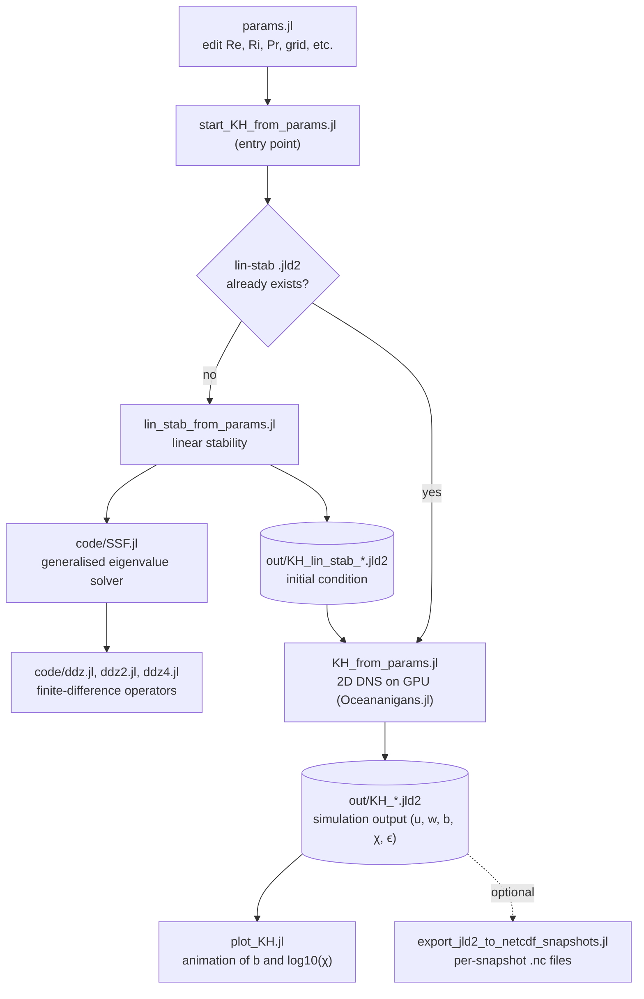

# 2D DNS of stratified shear flow and Kelvin-Helmholtz instability with Oceananigans.jl on GPU

Two-dimensional direct numerical simulations of the Kelvin-Helmholtz instability in stratified shear flow, using [Oceananigans.jl](https://github.com/CliMA/Oceananigans.jl) on a CUDA GPU.

This is the simulation code accompanying the paper:

> Lefauve, A., Bassett, C., Plotnick, D. S., Lavery, A. C., and Geyer, W. R. (2026). *The structure and lifecycle of stratified mixing by shear instabilities in continuously forced flows.* Preprint: [10.22541/essoar.176676944.48233717/v1](https://doi.org/10.22541/essoar.176676944.48233717/v1) *(currently under peer review)*.

## Requirements

- Julia 1.11.5 — download from https://julialang.org/downloads/
- NVIDIA GPU with CUDA drivers installed (the simulation is GPU-only)

A CPU-only Julia install is sufficient for the linear-stability precompute (see below).

## Setup (one time)

```bash
julia --project=. -e 'import Pkg; Pkg.instantiate()'
```

`Pkg.instantiate()` reads `Manifest.toml` and installs every dependency at the exact versions used to produce the published results. No manual package hunting needed.

## Running

Edit simulation parameters in `params.jl`, then on a GPU workstation:

```bash
julia --project=. start_KH_from_params.jl
```

Or on a SLURM cluster:

```bash
sbatch run_KH.slurm
```

### Linear-stability initial condition

The simulation uses linear-stability eigenmodes as initial conditions. If a matching `.jld2` file is not found, `start_KH_from_params.jl` will call `lin_stab_from_params.jl` automatically. In practice it's much faster to run the eigenvalue problem on a workstation CPU and copy the resulting `.jld2` to the cluster than to do it on the GPU node:

```bash
julia --project=. lin_stab_from_params.jl
```

The `.jld2` file used in the paper (Re=8e5, Ri=0.15, Pr=700, Lz=10) is available in the data deposit (see *Data* below).

### Output

Simulation output is written as `.jld2` (full state, large) on the cluster, containing the streamwise velocity `u`, vertical velocity `w`, buoyancy `b`, buoyancy-variance dissipation `χ`, and kinetic-energy dissipation `ϵ`. Use `export_jld2_to_netcdf_snapshots.jl` to extract individual snapshots as much smaller `.nc` files for downstream analysis and plotting.

## Call flow



## File overview

| File | Purpose |
|------|---------|
| `params.jl` | Simulation parameters (Re, Ri, Pr, grid size, etc.) |
| `start_KH_from_params.jl` | Main entry point — runs the DNS |
| `KH_from_params.jl` | Core simulation setup and time-stepping (Oceananigans + GPU) |
| `lin_stab_from_params.jl` | Linear stability analysis (initial-condition generator) |
| `plot_KH.jl` | Visualisation: buoyancy + log₁₀(χ) animation (default) |
| `plot_KH_b_only.jl` | Lighter visualisation: buoyancy only |
| `export_jld2_to_netcdf_snapshots.jl` | Convert `.jld2` output to per-snapshot `.nc` |
| `run_KH.slurm` | Example SLURM submission script |
| `code/SSF.jl` | Generalised eigenvalue stability solver (used by linear stability) |
| `code/ddz.jl`, `ddz2.jl`, `ddz4.jl`, `ddz_nonuni.jl` | Finite-difference operator matrices |

### Environment files

| File | Purpose |
|------|---------|
| `Project.toml` | Direct dependencies (human-readable) |
| `Manifest.toml` | Exact versions of all packages, including transitive deps, pinned to Julia 1.11.5 |

Both files must be kept together. Do not edit `Manifest.toml` by hand.

## Data

This repository contains source code only. Simulation outputs (`.nc`, `.jld2`), the supplementary movie (`.mp4`), the example linear-stability eigenmode file used in the paper, and grid-convergence movies are provided in the full research data deposit:

> Lefauve, A. *et al.* (2026). Research data supporting "The structure and lifecycle of stratified mixing by shear instabilities in continuously forced flows." [Data set]. Imperial College London. [10.82186/myzcg-jwm39](https://doi.org/10.82186/myzcg-jwm39)

The simulation-specific subset is in `04_simulation_movie_and_code/` of that deposit.

## Benchmarks

Wall-clock timings on RTX 2000, RTX 4080 SUPER, and A100-40G GPUs, plus a discussion of why this DNS is memory-bandwidth limited rather than compute limited, are in [`BENCHMARKS.md`](BENCHMARKS.md).

## Citation

If you use this code, please cite the paper above. A `CITATION.cff` file is included so GitHub renders a "Cite this repository" button.

## Acknowledgements

The linear-stability code in `code/` (`SSF.jl`, `ddz.jl`, `ddz2.jl`, `ddz4.jl`, `ddz_nonuni.jl`) is adapted from *Project 3 (KH)* of John R. Taylor's [FDSE](https://github.com/johnryantaylor/FDSE/tree/main) course repository. The original MATLAB implementation of `SSF` is by W. Smyth (Oregon State University); the Julia port is by John Taylor.

Thanks also to [Amir Atoufi](https://github.com/amiratoufi), [Samuel Lewin](https://github.com/samlewin), and Emma Bouckley for sharing pieces of code that were reused or adapted in this repository.

## License

Released under the MIT License — see [`LICENSE`](LICENSE).
